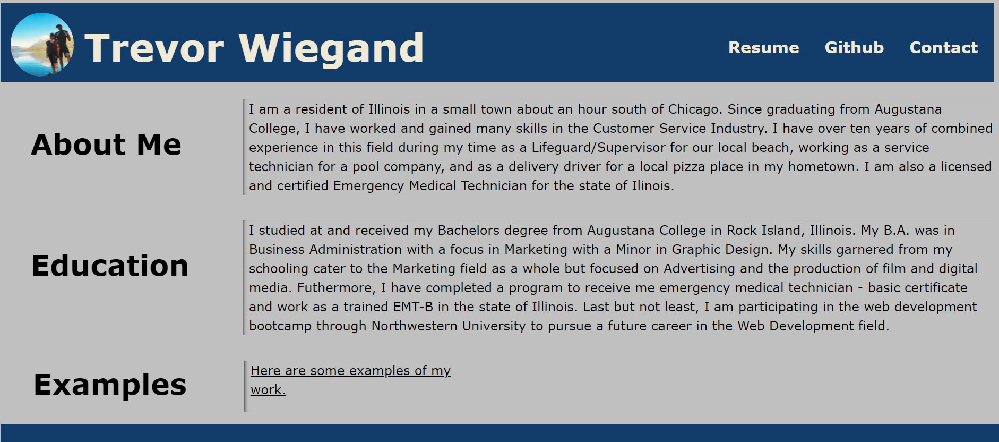
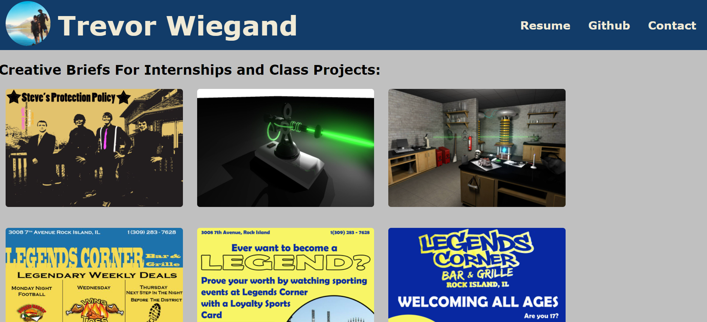

Finished homework assignment for week two. Creating our own portfolio.

NAME: Trevor Wiegand's Portfolio

This is my portfolio website for the eighth homework assignment, and the beginnings of what will eventually become my professional portfolio for future showings of my work and experience. 

The objective of this assignment was to create the beginnings of our own portfolio to showcase our skills and talents to employers. It was also to learn how to create webpages that are responsive in its design so users can experience the website using any size screen.

When nearing the end of the class, I'll delete most of the stuff in this readme describing it as a homework assignment and legitimately use it as my professional portfolio

Live URL:

https://trevorwiegand92.github.io/Trevor-Wiegand-Portfolio/

Github Repository URL:

https://github.com/trevorwiegand92/Trevor-Wiegand-Portfolio

